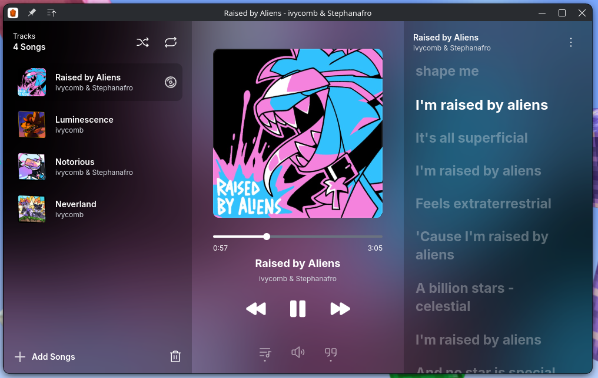

# Flint



Flint is a music player based on React + Electron

Flint is still in development

## How to run
First, clone this repository
```
git clone https://github.com/ferdinankurnian/flint.git
```

Go to flint directory
```
cd flint
```

And then install dependencies by runnning:
```
pnpm install
```

Now you can run flint with
```
pnpm dev
```

There's bugs and uncomplete features, because this still under development.
Please wait, thanks for your patience :)
